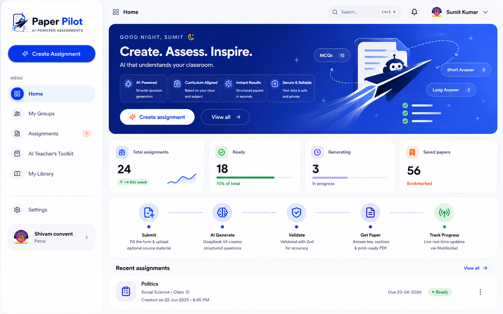
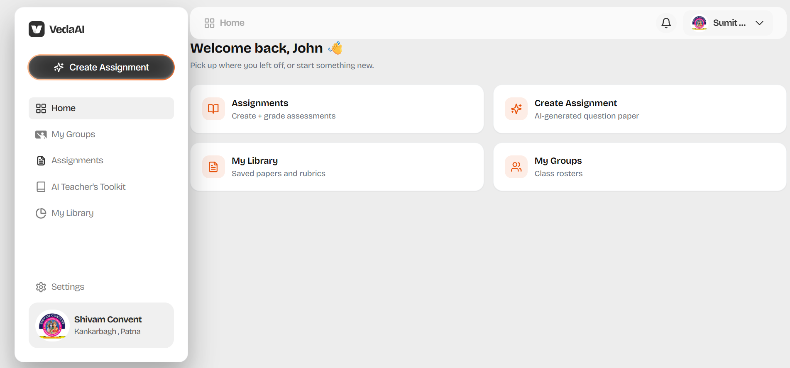
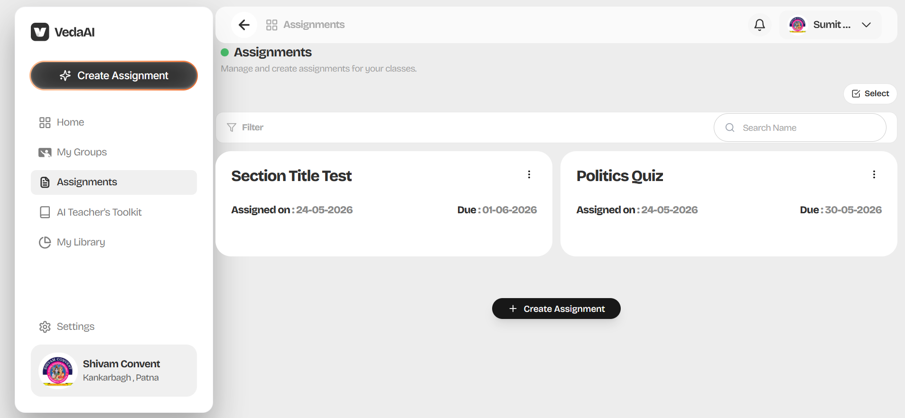
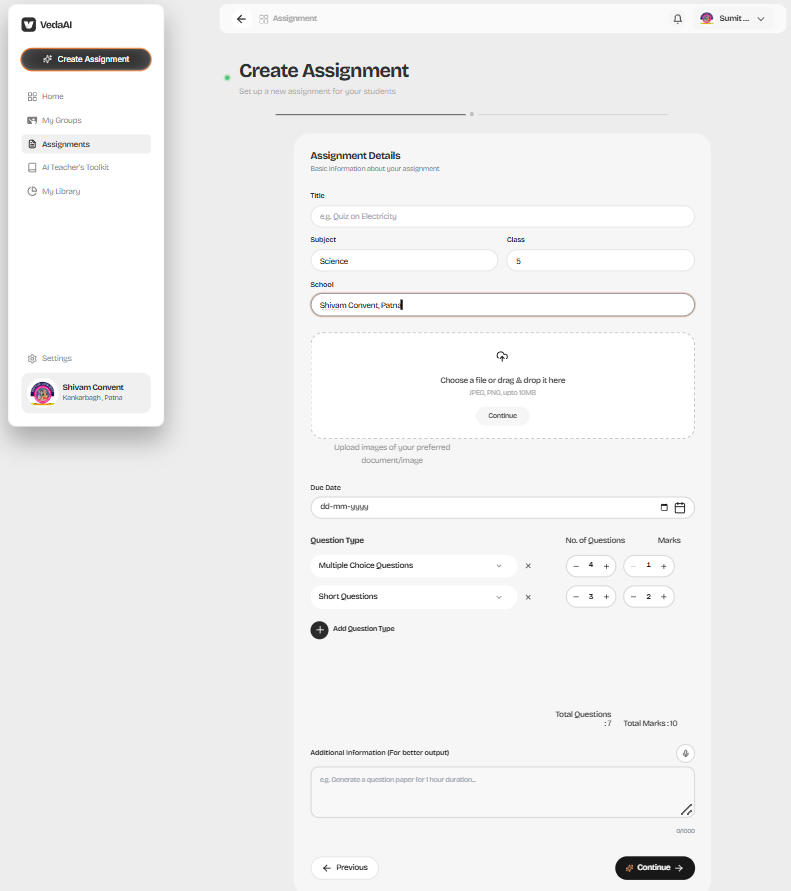
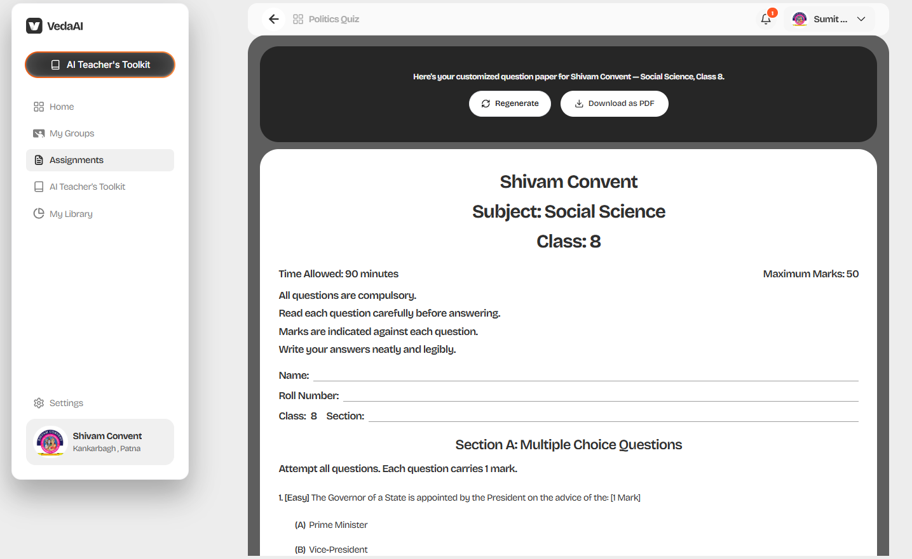
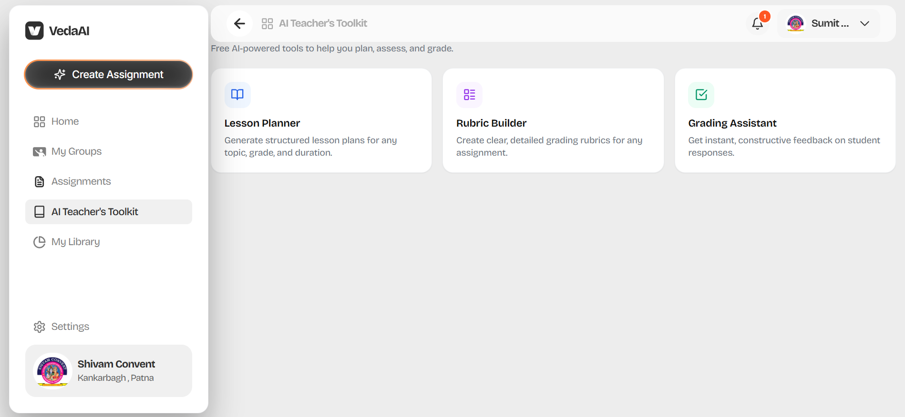

# Paper Pilot



Paper Pilot is an AI-powered assessment creation platform built for educators. A teacher fills in a guided form — subject, class, question types, marks distribution — optionally uploads a source document (PDF, DOCX, or plain text), and clicks Generate. Within seconds, a structured, print-ready question paper appears, complete with an answer key and section breakdown.

### How it works

1. **Submit** — the web app sends the form (and optional file) to the Express API. The API validates the payload, saves the assignment, and immediately enqueues a generation job. The response returns to the browser in under 300 ms.

2. **Generate** — the BullMQ worker picks up the job, builds a structured prompt from the assignment spec and any uploaded source material, and calls the DeepSeek LLM. The response is validated against a strict Zod schema. If the first attempt fails validation, the worker automatically retries with a refinement prompt before giving up.

3. **Progress** — as each stage completes (analyzing → building prompt → generating → parsing → saving), the worker publishes events to Redis Pub/Sub. The API bridges those events over Socket.IO so the browser shows a live step-by-step progress timeline — no polling, no spinner.

4. **Paper** — once validated, the paper is saved to MongoDB with sections grouped by question type, normalized titles (e.g. "Section A: Multiple Choice Questions"), and a complete answer key.

5. **PDF** — on first download, PDFKit renders the paper into a print-ready PDF and caches it in Redis for 24 hours. Subsequent downloads are served straight from the cache (~12× faster).

The platform also includes an **AI Teacher's Toolkit** — standalone tools for grading rubrics, lesson plans, and more, powered by the same DeepSeek backend.


## Tech stack

Next.js 14 · React 18 · Tailwind · Zustand · Express 4 · Socket.IO · BullMQ · Mongoose · OpenAI SDK (DeepSeek) · PDFKit · Zod · pnpm workspaces

## Screenshots

| Home Feed | Assignments |
|---|---|
|  |  |

| Generate Assignment | Paper Generated |
|---|---|
|  |  |

| AI Teacher's Toolkit | |
|---|---|
|  | |

## Quick start

```bash
pnpm install
pnpm dev
```

Requires Node ≥ 18.17, pnpm ≥ 9, MongoDB, Redis, and a DeepSeek API key. See [docs/setup.md](docs/setup.md) for details.


## Architecture overview

Three apps plus one shared package, with all expensive work pushed off the request path into a worker.

```text
[Next.js Web]
    | HTTP (REST) + WebSocket
    v
[Express API + Socket.IO]
    | enqueue jobs
    v
[BullMQ Queues on Redis] <----> [Worker]
    |                               |
    |                               | DeepSeek (LLM generation)
    |                               | PDFKit (PDF rendering)
    |
    +--> [MongoDB] (assignments, papers, statuses)

Progress path:
Worker -> Redis Pub/Sub -> API socket bridge -> assignment room in browser
```

See [docs/architecture.md](docs/architecture.md) for the monorepo layout, per-app responsibilities, and validation strategy.

## Approach

1. Model the domain first in `packages/shared` using Zod schemas.
2. Keep API request handling lightweight and queue-based.
3. Run expensive work (LLM + PDF) in a dedicated worker process.
4. Validate generated content before persistence and again before PDF rendering.
5. Stream step-level progress to users over WebSocket for transparency.
6. Reuse one type system across web, API, and worker for contract safety.

## Documentation

- [Architecture](docs/architecture.md) — monorepo layout, runtime topology, components, validation strategy
- [API & Event Flow](docs/api.md) — REST surface, queue flow, progress event stages
- [Environment Contracts](docs/environment.md) — env vars per app
- [Setup & Run](docs/setup.md) — prerequisites, install, dev/build/typecheck, quality checklist
- [Deployment](docs/deployment.md) — Vercel (web) + Render (api/worker) blueprint
- [Metrics](docs/metrics.md) — operational metrics + storage targets
- [Benchmarks](docs/benchmarks.md) — performance harness + baseline results

## License

[MIT](LICENSE) © 2026 Sumit Kumar
